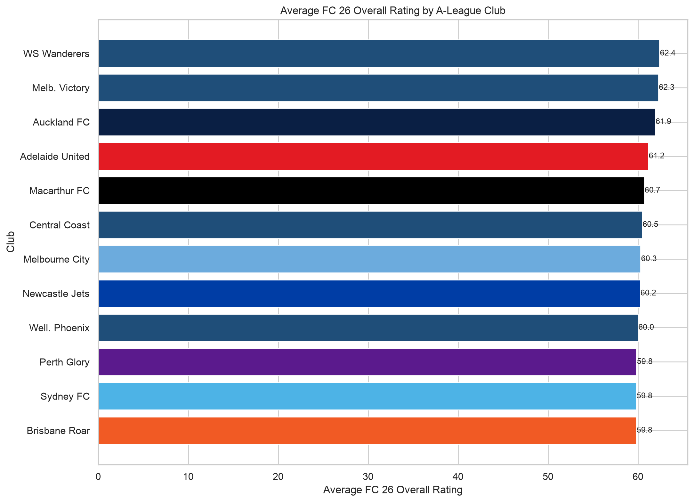
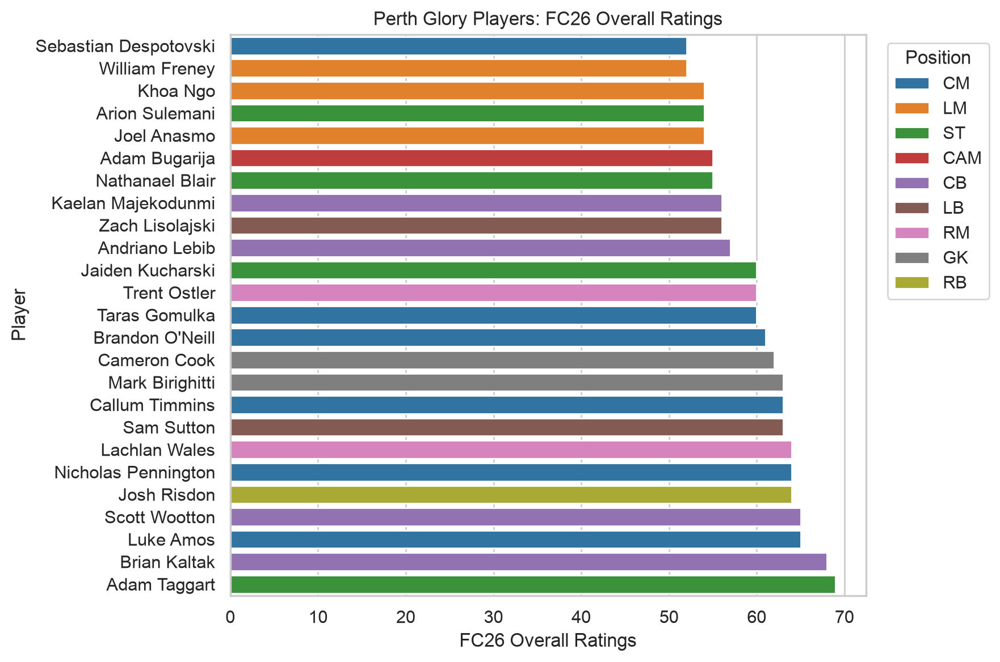
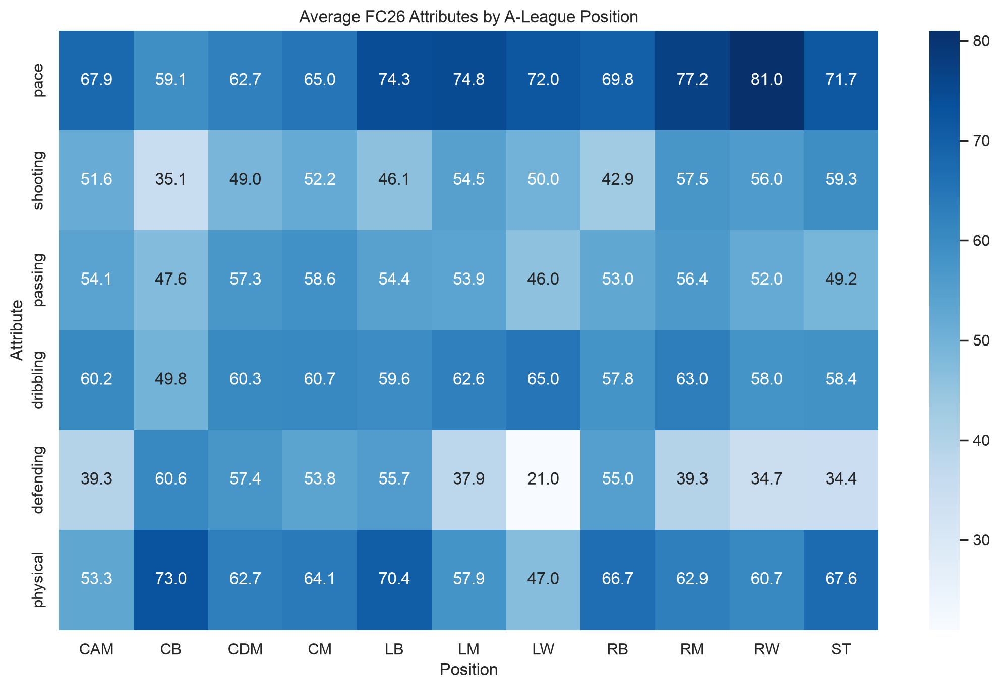

# EA Sports FC 26 A-League Player Ratings Explorer

A Python data-analysis project that explores EA Sports FC 26 game ratings and attributes for players listed in the A-League.

> Important: This project analyses EA Sports FC 26 game ratings and attributes. These are game values and are not real-world match statistics such as actual goals, assists, minutes played, or live player performance data.

## Project overview

This project filters the EAFC26 men's player database to players whose league is listed as `A-League`. It uses Python and Pandas to clean and transform the data, then uses Matplotlib and Seaborn to produce player, club, position, age, and Perth Glory comparisons.

The analysis includes:

- Top 15 A-League players by FC 26 overall rating.
- A-League club average overall-rating comparison.
- Overall rating by player age and position.
- Average outfield attributes by position.
- Perth Glory player ratings.
- Top A-League players aged 21 or under.

## Technologies used

- Python
- Pandas
- Matplotlib
- Seaborn
- CSV data processing

## Dataset

**Dataset:** EAFC26 Player Database  
**Creator:** Aiden Flynn  
**Platform:** Kaggle  

The original dataset is not included in this repository. It can be downloaded from Kaggle and should be saved in the main project folder as:

```text
EAFC26-Men.csv
```

Please review the dataset licence and Kaggle terms before downloading, using, or redistributing the original data.

## How to run the project

### 1. Download or clone this repository

```bash
git clone [https://github.com/TheRedBelgian/fc26-a-league-player-ratings-explorer.git](https://github.com/TheRedBelgian/fc26-a-league-player-ratings-explorer.git)
cd fc26-a-league-player-ratings-explorer
```

### 2. Install the required packages

```bash
pip install pandas matplotlib seaborn
```

### 3. Download the dataset

Download the EAFC26 Player Database from Kaggle.

Place the men's player CSV in the main project folder and name it:

```text
EAFC26-Men.csv
```

### 4. Run the analysis

```bash
python fc26_a_league_ratings_explorer.py
```

The program creates an `outputs` folder containing cleaned data, summary tables, and charts.

## Key analysis steps

1. Loads the EAFC26 men's player CSV file.
2. Filters records where `League` equals `A-League`.
3. Selects relevant player, club, position, age, and rating fields.
4. Renames abbreviated FC 26 columns such as `OVR`, `PAC`, `SHO`, `PAS`, `DRI`, `DEF`, and `PHY`.
5. Converts relevant fields into numeric data types.
6. Removes duplicate player/team records and rows missing essential values.
7. Creates age-group categories and an outfield attribute-average field.
8. Generates CSV summaries and PNG visualisations.
   
## Visualisations

### Average FC 26 overall rating by A-League club



### Perth Glory player ratings



### Average FC 26 attributes by A-League position


## Limitations

- FC 26 ratings and attributes are game data, not real-world match-performance data.
- The analysis reflects the dataset version downloaded from Kaggle and may not reflect later squad, player, league, or rating updates.
- Club-level averages depend on the players and ratings included in the downloaded dataset.
- This project is descriptive exploratory data analysis; it does not make predictions or recommend player recruitment decisions.

## Author

Stephane Mammo Zagarella  
Bachelor of Information Technology student, Kaplan Business School, Perth, Western Australia.
